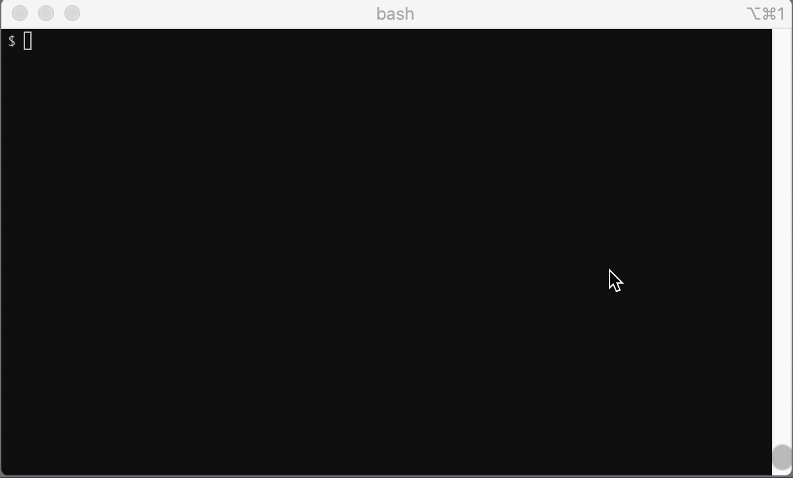

<a href="https://codeclimate.com/github/tkibe/mfa/maintainability"></a>
[](https://opensource.org/licenses/MIT)


# mfa

Tool to do Multi-Factor Authentication (MFA) in CLI.

## Demo



## Required environment

- OS X, Linux
- Python 3.x

## Basic Setup

1. Download PC.

   ```bash
   $ git clone git@github.com:tkibe/mfa.git ~/bin/mfa
   ```

2. Install the Python packages CLI as follows:

   ```bash
   $ cd ~/bin/mfa
   $ pip install -r requirements.txt
   ```

   **_Note_**: If you're having permission issues on your system installing the CLI, please try the following command:

   ```bash
   $ sudo pip install -r requirements.txt
   ```

3) Simply setting the "MFA" name and secret. (YAML format)


    This example defines a key "Demo MFA 1" with value MFA secret key, a key "Demo MFA 2" with value MFA secret key that is itself set of key/value pairs.   
    To encrypt a key/value pairs, use "ansible-vault" to set a password.
    ```bash
    e.g.)
    $ echo "Demo MFA 1: z7EKrWNx2T86FcLrNyiRKSnXVawe8kHx" >> demo/example.yml
    $ echo "Demo MFA 2: jJNHhNBYujPFhKt4c3MC7Sk7QuTd53S8" >> demo/example.yml
    $ ansible-vault encrypt demo/example.yml
    New Vault password:
    Confirm New Vault password:
    ```

4. To run this tool, you need to set valid environment variable "MFA_FILE" beforehand.

   ```bash
   e.g.)
   $ export MFA_FILE=~/bin/mfa/demo/example.yml
   ```

5. Can be executed when the setting is completed.

    Enter the password you have set for "ansible-vault" and you will see the one-time password.

   ```bash
   $ python ~/bin/mfa/mfa/main.py
   Vault password:
   +---------------+--------+
   |     Name      |  Code  |
   +===============+========+
   | Example MFA 1 | xxxxxx |
   +---------------+--------+
   | Example MFA 2 | xxxxxx |
   +---------------+--------+
   ```

   It also feasible to narrow down the list.

   ```bash
   e.g.)
   $ python ~/bin/mfa/mfa/main.py | grep "1"
   Vault password:
   | Demo MFA 1  | xxxxxx |
   $ python ~/bin/mfa/mfa/main.py | grep "2"
   Vault password:
   | Demo MFA 2  | xxxxxx |
   ```

## Recommended settings

If you want to use it permanently, add the setting to `~/.bash_profile`.

```
$ echo "export MFA_FILE=~/bin/mfa/auth.yml" >> ~/.bash_profile
$ echo 'alias mfa="python ~/bin/mfa/mfa/main.py"' >> ~/.bash_profile
$ echo "<Your secret key>: xxxxxxxxxx" >> ~/bin/mfa/auth.yml
```
